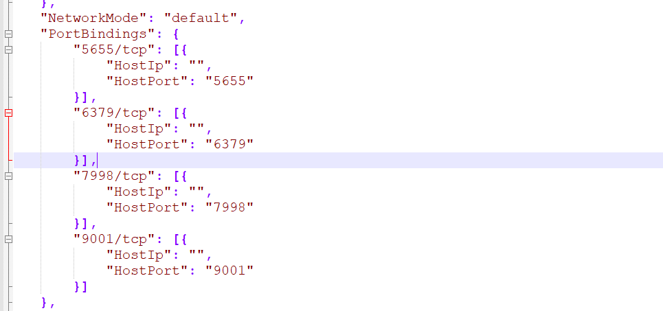
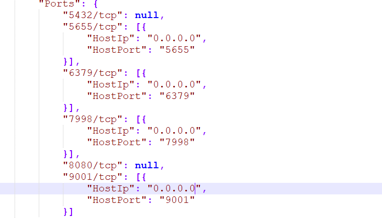

### docker 安装与使用

#### 1.docker 安装与配置

1. win10 docker虚拟机 切换root用户

   ```shell
   sudo -i
   ```

2. windows 访问docker容器配置

```shell
#cmd环境下执行如下命令，添加一条路由
route add -p 172.17.0.0 mask 255.255.0.0 192.168.99.100
```

3. docker 配置容器ssh 远程登录

```shell
#1.安装openssh 服务
yum -y install openssh-server
yum -y install openssh-clients
#2. 生成密钥
/usr/sbin/sshd-keygen -A
#3. 启动ssh服务
/usr/sbin/sshd
#4.免密码本机跳本机
ssh-keygen -t rsa -P '' -f ~/.ssh/id_rsa
cat ~/.ssh/id_rsa.pub >> ~/.ssh/authorized_keys
chmod 0600 ~/.ssh/authorized_keys
#5. 允许root密码登录
vim /etc/ssh/sshd_config #打开注释 PermitRootLogin yes, 允许密码登录,保存退出
#6. 修改容器端口映射


#7. 修改宿主主机端口方
iptables -A INPUT -p tcp --dport 2222 -j ACCEPT   (貌似没用，最终还是用22短扣可以登录)
iptables-save > /etc/iptables.rules


```


#### 2. docker 使用与常用命令

1. 新建容器并运行

```shell
#docker 创建一个新的容器并运行
# -i 以交互模式运行容器 -t 为容器分配一个伪输入终端
# -p 指定端口映射
# 9aec5c5fe4ba 为镜像id
docker run -it  -p 5432:5432 -p 8090:8080  9aec5c5fe4ba   /bin/bash
```

2. 启动已终止的容器

```shell
# 启动一个已终止的容器 
docker  start container_id
```

3. 容器与镜像的查看

```shell
# 列出正在运行的容器
docker ps
# 列出所有容器
docker ps -a
# 列出所有镜像
docker images
```

4. 容器已启动，进入容器

```shell
docker exec -ti container_id /bin/bash
```

5. 删除容器或镜像

```shell
# 删除容器
docker rm container_id
# 删除镜像
docker rmi image_id
```

6. docker 从容器创建一个新的镜像

```shell
# 从容器创建一个新的镜像
# -a 镜像的作者
# -m 提交说明的文字 
docker commit -a "haozi" -m "configure pyenv and install python 2.7.3 python 3.7.3" 3bc29b4d47af pyenv:v1
```

7. 容器和主机之间的数据拷贝

   ```shell
   # （Docker Quickstart Terminal到文件所在目录执行执行 78299019a3ff为容器id）
   docker cp stream2stream.json 78299019a3ff:/root/ 
   
   ```

docker cp 78299019a3ff:/root/linkxDI.zip ./ 

   ```
#### 3 .docker 常见问题

修改docker容器的端口号：

​```shell
 sudo vi /var/lib/docker/containers/b6f79711f78*/hostconfig.json
 sudo vi /var/lib/docker/containers/b6f79711f78*/config.v2.json
   ```

hostconfig.json 配置文件如下图：



config.v2.json 配置文件如下图：

